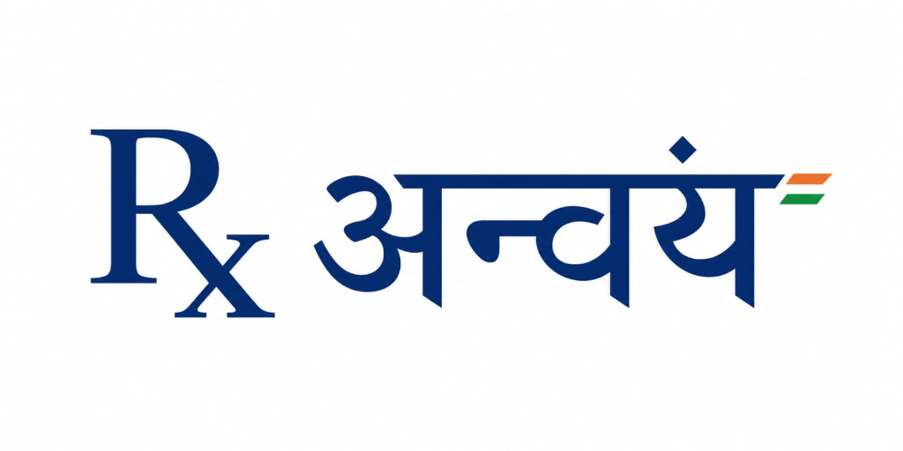

<div align="center">

  

  # 🩺 RxAnvaya
  ### Multilingual Clinical Lab Report Intelligence & Patient Companion

  **Democratizing laboratory diagnostics with AI-powered interpretation, verified clinical evidence, and native voice assistance for 1.4+ billion citizens.**

  *Crafted with ❤️ by **Team Anvaya***

  <p align="center">
    <a href="#-quickstart"></a>
    <a href="#-sample-reports"></a>
    <a href="#-contributing"></a>
  </p>

  [](https://github.com/yashsva133/anvaya/actions/workflows/ci.yml)
  [](LICENSE)
  [](https://nextjs.org/)
  [](https://react.dev/)
  [](https://www.typescriptlang.org/)
  [](https://tailwindcss.com/)
  [](https://supabase.com/)
  [](https://github.com/PaddlePaddle/PaddleOCR)
  [](CONTRIBUTING.md)

  <br />

  > ⭐ **Star Us on GitHub!** If you believe accessible healthcare diagnostics should be open to all, please star this repository!

</div>

---

## 📖 Table of Contents

- [The Healthcare Dilemma](#-the-healthcare-dilemma)
- [What is RxAnvaya?](#-what-is-rxanvaya)
- [Key Features](#-key-features)
- [System Architecture](#-system-architecture)
- [Supported Languages (14+)](#-supported-languages-14)
- [Clinical Safety & Guardrails](#-clinical-safety--guardrails)
- [Database & Security (ABDM Aligned)](#-database--security-abdm-aligned)
- [Quickstart (5-Minute Setup)](#-quickstart)
- [Sample Reports for Testing](#-sample-reports)
- [Testing & Quality Verification](#-testing--quality-verification)
- [Project Layout](#-project-layout)
- [Contributing](#-contributing)
- [Team Anvaya & Acknowledgements](#-team-anvaya--acknowledgements)
- [License](#-license)

---

## 🚨 The Healthcare Dilemma

In India and across developing nations, laboratory diagnostic reports form the backbone of clinical decision-making. Yet **over 80% of patients cannot interpret their own test results**.

- **Jargon & Cryptic Metrics**: Values like `MCV: 72 fL`, `SGPT: 68 U/L`, or `ANC: 1200 /cumm` induce anxiety, confusion, and fear.
- **Language Barriers**: 90%+ of diagnostic slips are generated in English, while the vast majority of patients communicate in regional Indian languages.
- **Isolated Snapshots**: Reports are viewed as disconnected one-off numbers rather than longitudinal trends, causing patients to miss gradual deteriorations (such as developing microcytic anemia, metabolic syndrome, or progressive renal stress).
- **The Danger of LLM Hallucinations**: Unconstrained AI chatbots frequently invent clinical numbers, misread units, or offer unsafe medical advice.

---

## 💡 What is RxAnvaya?

**RxAnvaya** (meaning *"coherent connection or relationship"* in Sanskrit) is an open-source, patient-centric clinical lab report intelligence platform.

It ingests printed diagnostic slips, mobile camera snapshots, PDFs, and laboratory exports, normalizes them against verified **ICMR (Indian Council of Medical Research)** and **WHO** reference intervals, and translates clinical observations into 3 tailored reading tiers:
1. **Very Simple**: Clear, conversational explanations for everyday patients and caregivers.
2. **Simple**: Plain-language summaries connecting related diagnostic values.
3. **Clinical / Standard**: Detailed, evidence-backed breakdown citing clinical guidelines.

```
       [ Diagnostic Slip / PDF / Camera Photo ]
                          │
                          ▼
            [ RapidOCR / PaddleOCR Engine ]
                          │  (Normalized units & reference ranges)
                          ▼
     [ Privacy Anonymizer (PII / ABHA ID Stripped) ]
                          │
                          ▼
    [ Deterministic Clinical Engine & MedGemma RAG ]
                          │  (ICMR / WHO / MedlinePlus Grounding)
                          ▼
   [ Multilingual Explanation & Native Voice Agent ]
          (English • हिन्दी • বাংলা • தமிழ் • etc.)
```

---

## ✨ Key Features

### 🔬 1. Intelligent Multi-Format Report Ingestion
- Upload scanned images (PNG, JPG, WebP), digital lab PDFs, or camera captures from mobile devices.
- Lightweight on-device / backend OCR pipeline powered by **PaddleOCR / RapidOCR ONNX** for fast execution without heavy GPU requirements.
- Smart unit normalization (`gm/dl` → `g/dL`, `lakh/cumm` → `10^3/µL`, `mg/dL`).
- Automatic test code alias resolution (e.g., `Hb`, `Hemoglobin`, `PCV`, `Packed Cell Volume`, `TLC`, `Total Leucocyte Count`).

### 🌐 2. 14+ Regional & Global Languages
- Breaks the medical literacy divide with end-to-end support for **14 Indian and international languages**.
- Bi-directional medical translation bridge preserving critical medical biomarker tokens and units across scripts.

### 🛡️ 3. Zero-Hallucination Clinical Guardrails
- **Ground Truth Invariance**: AI models are forbidden from altering or fabricating laboratory values. Every returned value is strictly traceable to the original uploaded document.
- **Anonymization Layer**: All Patient Identifiable Information (Name, Mobile, ABHA ID, MRN) is stripped before any external inference.
- **Strict Evidence Citation**: Explanations cite authoritative clinical sources (**MedlinePlus**, **ICMR Guidelines**, **CDC**, **AHA**).

### 🎙️ 4. Real-Time Multilingual Voice Agent
- Voice-first interaction designed for rural and semi-urban patients who prefer listening over reading.
- Native browser Web Speech API with automatic server-side fallbacks (Whisper STT & high-fidelity TTS) for cross-platform compatibility.

### 📈 5. Longitudinal Health Trends & Pattern Recognition
- Interactive Recharts visualization showing biomarker trajectory across multiple dates.
- Automated clinical pattern detection (e.g. *Microcytic Hypochromic Anemia*, *Inflammatory Response*, *Dyslipidemia*).

### 👨‍⚕️ 6. Clinician & Doctor Review Portal
- Side-by-side view for healthcare professionals to review raw laboratory outputs alongside patient-facing explanations.
- Clinicians can annotate findings, add clinical notes, and verify release to patients.

---

## 🏗️ System Architecture

```
┌────────────────────────────────────────────────────────────────────────┐
│                   RxAnvaya Web Client (Next.js 16 / React 19)          │
│        App Router • Tailwind CSS v4 • Framer Motion • Web Speech       │
└───────────────────────────────────┬────────────────────────────────────┘
                                    │
               ┌────────────────────┴────────────────────┐
               ▼                                         ▼
┌─────────────────────────────┐           ┌─────────────────────────────┐
│    Next.js API Gateway      │           │     Supabase Cloud / Local  │
│  • /api/process-report      │           │  • PostgreSQL with RLS      │
│  • /api/answer (MedGemma)   │           │  • Profiles, Patients       │
│  • /api/insights            │           │  • Lab Reports & Tests      │
│  • /api/stt & /api/tts      │           │  • Clinical Catalog (ICMR)  │
└──────────────┬──────────────┘           └─────────────────────────────┘
               │
               ▼
┌─────────────────────────────┐
│  PaddleOCR / Python Worker  │
│  • lab_ocr_paddleocr.py     │
│  • RapidOCR (ONNX Runtime)  │
└─────────────────────────────┘
```

---

## 🇮🇳 Supported Languages (14+)

RxAnvaya natively supports **14 languages** across conversational chat, definitional lookups, and voice interactions:

| Language | Script / Native Name | Code | Voice Support |
|:---|:---|:---:|:---:|
| **English** | English | `en` | ✅ |
| **Hindi** | हिन्दी | `hi` | ✅ |
| **Bengali** | বাংলা | `bn` | ✅ |
| **Tamil** | தமிழ் | `ta` | ✅ |
| **Telugu** | తెలుగు | `te` | ✅ |
| **Marathi** | मराठी | `mr` | ✅ |
| **Gujarati** | ગુજરાતી | `gu` | ✅ |
| **Kannada** | ಕನ್ನಡ | `kn` | ✅ |
| **Malayalam** | മലയാളം | `ml` | ✅ |
| **Punjabi** | ਪੰਜਾਬੀ | `pa` | ✅ |
| **Urdu** | اردو | `ur` | ✅ |
| **Odia** | ଓଡ଼ିଆ | `or` | ✅ |
| **Assamese** | অসমীয়া | `as` | ✅ |
| **Nepali** | नेपाली | `ne` | ✅ |

---

## 🛡️ Clinical Safety & Guardrails

RxAnvaya is engineered with defense-in-depth safety protocols:

1. **Non-Diagnostic Disclaimer**: RxAnvaya is an educational communication aid and never issues a formal medical diagnosis or prescription.
2. **Deterministic Rules Engine**: High-frequency medical definitions and critical status checks run deterministically on validated reference tables, guaranteeing consistent responses without latency.
3. **Token Preservation**: Protected medical terms (e.g. `[MED_VAL_0]`) are shielded during translation to prevent numbers or scientific units from being garbled.
4. **Refusal Redirection**: When asked off-topic, acute emergency, or diagnostic questions, the system gracefully redirects the patient to seek immediate in-person medical care.

---

## 🗄️ Database & Security (ABDM Aligned)

Built with **PostgreSQL** and **Supabase Row-Level Security (RLS)** to enforce tenant isolation:

- **`patients`**: Stores demographic baseline and consent status.
- **`lab_reports`**: Encapsulates collection date, laboratory details, and extraction status.
- **`test_results`**: Normalized biomarker readings with range flags (`normal`, `low`, `high`, `borderline`).
- **`lab_test_catalog`**: Seeded with 20+ comprehensive diagnostic tests and multilingual descriptions.
- **`doctor_reviews`**: Audit log of clinician verification and physician notes.

---

## 🚀 Quickstart

Get RxAnvaya running locally in under 5 minutes:

### 1. Clone the repository
```bash
git clone https://github.com/yashsva133/anvaya.git
cd anvaya
```

### 2. Install dependencies
```bash
npm install
```

### 3. Setup Environment Variables
```bash
cp .env.example .env.local
```
*Note: RxAnvaya includes an offline demo mode with built-in rule fallbacks, so you can explore the full UI immediately even without cloud API keys!*

### 4. (Optional) Setup Python PaddleOCR Pipeline
```bash
python -m venv venv

# Windows:
.\venv\Scripts\activate
# macOS / Linux:
source venv/bin/activate

pip install -r requirements.txt
```

### 5. Launch the Development Server
```bash
npm run dev
```
Open **[http://localhost:3000](http://localhost:3000)** in your browser!

---

## 🧪 Sample Reports

We provide clean, anonymized sample reports in the [`samples/`](samples/) directory for instant evaluation:

- [`samples/report1.png`](samples/report1.png): Scanned hematology diagnostic report.
- [`samples/cbc-report-format.pdf`](samples/cbc-report-format.pdf): Complete Blood Count (CBC) report in standard laboratory PDF format.
- [`samples/report3.pdf`](samples/report3.pdf): Multi-parameter clinical laboratory panel.
- [`samples/sample-lab-results.csv`](samples/sample-lab-results.csv): Tabular test CSV for instant parsing.

---

## 🧪 Testing & Quality Verification

RxAnvaya maintains strict code quality and comprehensive test coverage:

```bash
# 1. Type Safety Check (TypeScript strict)
npm run typecheck

# 2. Linting (ESLint 9 Flat Config)
npm run lint

# 3. Clinical & Extraction Test Suite (35 tests)
npm test

# 4. Production Build Verification
npm run build
```

---

## 📂 Project Layout

```
anvaya/
├── .github/                   # GitHub Actions CI, issue and PR templates
│   ├── workflows/ci.yml       # Automated CI build, lint, and test runner
│   └── ISSUE_TEMPLATE/        # Structured bug & feature request forms
├── db/                        # Supabase PostgreSQL schema and 23 migrations
│   ├── migrations/            # Ordered SQL migration history
│   └── anvaya_schema.sql      # Single-file idempotent schema setup
├── public/                    # Logos, SVG icons, and clinical illustrations
├── samples/                   # Anonymized sample PDF, PNG, and CSV test reports
├── scripts/                   # Automated clinical test runners & mock servers
├── src/
│   ├── app/                   # Next.js 16 App Router (pages & API routes)
│   │   ├── api/               # Serverless endpoints (/answer, /process-report, /tts)
│   │   ├── dashboard/         # Patient health overview
│   │   ├── reports/           # Past reports repository
│   │   ├── upload/            # Multi-format report uploader
│   │   ├── ask/               # Multilingual AI companion
│   │   ├── voice/             # Conversational voice agent
│   │   ├── trends/            # Longitudinal biomarker charts
│   │   └── doctor/            # Doctor clinical verification dashboard
│   ├── components/            # Reusable UI primitives, cards, and navigation shell
│   ├── context/               # ReportDataContext & auth state providers
│   └── lib/                   # Clinical rule catalog, RAG, i18n, and OCR bridge
├── lab_ocr_paddleocr.py       # Standalone PaddleOCR extraction script
├── CONTRIBUTING.md            # Contributor guidelines
├── CODE_OF_CONDUCT.md         # Contributor Covenant v2.1
├── SECURITY.md                # Vulnerability disclosure policy
└── LICENSE                    # MIT License
```

---

## 🤝 Contributing

We welcome contributions from developers, clinicians, translators, and healthcare advocates! Whether you want to add new Indian languages, expand the clinical test catalog, or improve OCR extraction:

1. Read our [Contributing Guidelines](CONTRIBUTING.md).
2. Check open issues or start a discussion.
3. Submit a Pull Request following our [PR Template](.github/pull_request_template.md).

---

## 👥 Team Anvaya & Acknowledgements

**RxAnvaya** is engineered and maintained with pride by **Team Anvaya**:
- **Problem Statement**: Bridging the healthcare communication divide with AI & regional languages.
- **Built for**: Smart India Hackathon & Open Healthcare Innovation.
- **Clinical References**: [MedlinePlus (NLM)](https://medlineplus.gov/), [ICMR Guidelines](https://www.icmr.gov.in/), [World Health Organization](https://www.who.int/).

---

## 📄 License

This project is open-source software licensed under the **[MIT License](LICENSE)**.

---

<div align="center">
  <b>Empowering every patient to understand their health in their own words.</b><br />
  <sub>Made with ❤️ by Team Anvaya</sub>
</div>
